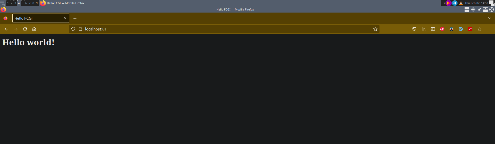

# Table of Contents

1.  [Simple Docker](#org53f3f14)
    1.  [Часть 1. Готовый docker](#org06b6a38)
    2.  [Часть 2. Операции с контейнером](#org2833c5b)
    3.  [Часть 3. Мини веб-сервер](#org7572688)

# Simple Docker

## Часть 1. Готовый docker

Скачивание docker-образа nginx

Docker-образ nginx

Запуск docker-образа nginx

Результат команды docker ps

Информация о контейнере с помощью команды docker inspect nginx

Размер контейнера

Вывод порта и IP адреса контейнера

Остановка контейнера

Запуск nginx на локальной машине

Стартовая страница nginx

## Часть 2. Операции с контейнером

Доступ в контейнер с помощью команды docker exec

Файл nginx.conf в контейнере

Файл nginx.conf на локальной машине

Копирование файла nginx.conf с локальной машины в контейнер

Перезапуск nginx в контейнере

Страница localhost:80 на локальной машине

Страница localhost:80/status на локальной машине

Сохранение контейнера с помощью docker export

Остановка контейнера

Удаление образа nginx

Удаление остановленного контейнера

Добавление образа с помощью docker import

Запуск контейнера my_nginx

Страница localhost:80

Страница localhost:80/status

## Часть 3. Мини веб-сервер

Код hello_fcgi.c

Создание процесса с помощью spawn-fcgi

Конфигурация nginx.conf для проксирования fcgi-запросов

Страница по адресу localhost:81

