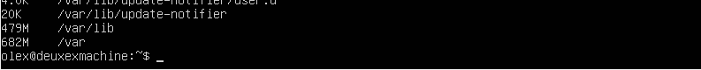
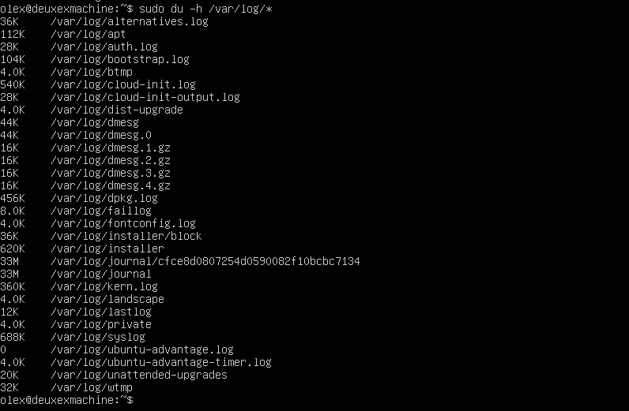

# Table of Contents

1.  [Linux](#org1d20b87)
    1.  [Задание 1. Установить ubuntu server 20.04 lts без GUI](#orgb0ee320)
    2.  [Задание 2. Создать пользователя. Он должен состоять в группе adm](#org94a5ca0)
    3.  [Задание 3. Настроить сеть](#org6e3ebd1)
    4.  [Задание 4. Обновление системы](#org42108a5)
    5.  [Задание 5. Разрешение пользователю выполнение команды sudo](#orgb74f2fe)
    6.  [Задание 6. Установка и настройка службы времени](#orgea94283)
    7.  [Задание 7. Установка и использование текстовых редакторов](#orgd221c72)
    8.  [Задание 8. Установка и базовая настройка сервиса SSHD](#org918be90)
    9.  [Задание 9. Установка и использование утилит top, htop](#orgebae288)
    10. [Задание 10. Использование утилиты fdisk](#org6f4afd2)
    11. [Задание 11. Использование утилиты df](#org41d9282)
    12. [Задание 12. Использование утилиты du](#org15d0949)
    13. [Задание 13. Установка и использование утилиты ncdu](#org12df4ef)
    14. [Задание 14. Работа с системными журналами](#orgb5729ad)
    15. [Задание 15. Использование планировщика заданий CRON](#orgf86d714)

# Linux

## Задание 1. Установить ubuntu server 20.04 lts без GUI

Версия ubuntu

## Задание 2. Создать пользователя. Он должен состоять в группе adm

Создание нового пользователя

Вывод команды 'cat /etc/passwd'

## Задание 3. Настроить сеть

-   задать название машины user-1
    
    

-   Установить временную зону
    
    

-   Вывести название сетевых интерфейсов,
    
    

lo интерфейс - устройство обратной связи - это виртуальный сетевой
  интерфейс, который используется для связи устройства с самим
  собой. Он используется для устранения неполадок и для подключения к
  серверам, которые работают на локальной машине.

-   Получить ip-адрес устройства, на коротом устройство работает от DHCP-сервера

DHCP - dynamic host configuration protocol - это протокол
динамической настройки сети.

-   Получить ip-адрес шлюза и внутренний ip-адрес
    
    
    
    Глобальный и локальный ip адреса
-   Задать статичные настройки ip, gw, dns
    
    
    
    Настройки статического ip адреса в файле /etc/netplan/00-installer-config.yaml

-   Перезагрузить машину. Убедиться, что настройки сохранились. Проверить ping 1.1.1.1 и ya.ru
    
    
    
    Статический ip адрес установлен, есть доступ в интернет

## Задание 4. Обновление системы

Система обновлена до последней доступной версии

## Задание 5. Разрешение пользователю выполнение команды sudo

Добавление пользователя в файл /etc/sudoers

Изменённое имя устройства

-   Команда sudo используется для того, чтобы запускать команды от имени
    другого пользователя, в особенности - root. Без этой команды каждый
    раз когда нужно выполнить команду, для которой требуются права root,
    пришлось бы логиниться как root.

## Задание 6. Установка и настройка службы времени

Время и часовой пояс корректно настроены

## Задание 7. Установка и использование текстовых редакторов

-   Vim
    
    
    
    Текстовый редактор vim установлен
    
    
    
    Для сохранения и выхода файла с помощью vim выполнена команда ":wq"

-   Emacs
    
    
    
    Текстовый редактор emacs установлен
    
    
    
    Для сохранения и выхода файла с помощью Emacs выполнена команда
    "Ctrl-x Ctrl-s" для сохранения файла и "Ctrl-x Ctrl-c" для выхода из
    редактора.

-   Nano
    
    
    
    Текстовый редактор nano установлен
    
    
    
    Для сохранения и выхода файла с помощью nano выполнена команда
    "Ctrl-o" для сохранения файла и "Ctrl-x" для выхода из редактора.

## Задание 8. Установка и базовая настройка сервиса SSHD

Сервис sshd установлен

Служба sshd автоматически включается при запуске системы

Служба sshd настроена на порт 2022

Процесс sshd запущен на системе

-   флаг "-e" выводит все процессы, запущенные на системе. "|" -
    перенаправляет вывод команды. "grep ssh" - выводит только те строки
    вывода команды "ps", в которых есть "ssh"
    
    
    
    Служба sshd установлена и настроена на порт 2022

-   Флаг "-t" - вывод tcp подключений. Флаг "-a" - вывод как
    прослушиваемых, так и непрослушиваемых подключений. Флаг "-n" -
    вывод значений адресов.

## Задание 9. Установка и использование утилит top, htop

Вывод команды top

-   Uptime - 19 минут; Кол-во авторизированных пользователей - 1; Общая
    загрузка системы - 0.00 за 1 минуту, 0.00 за 5 минут и 0.04 за 15
    минут; Количество процессоров - 1; Загрузка памяти - 143.8 МБ, PID
    процесса, занимающего больше всего памяти - 1458; PID процесса,
    занимающего больше всего процессорного времени - 1458

Вывод команды htop, процессы отсортированы по PID

Вывод команды htop, процессы отсортированы по PERCENT​​\_CPU

Вывод команды htop, процессы отсортированы по PERCENT​\_MEM

Вывод команды htop, процессы отсортированы по TIME

Вывод команды htop для процесса sshd

Вывод команды htop для процесса syslog

Вывод команды htop с добавлением опций uptime, clock и hostname

## Задание 10. Использование утилиты fdisk

Вывод команды fdisk -l

-   Название диска - /dev/sda; Кол-во секторов - 1; Размер диска - 8GB; Размер swap - 1013Mb

## Задание 11. Использование утилиты df

Вывод команды df /

-   Единица измерения - блоки размером 1 Килобайт

-   Тип файловой системы - ext4

## Задание 12. Использование утилиты du

Вывод команды du -h /home

Вывод команды du -h /var

Вывод команды du -h /var/log

Вывод команды du -h /var/log/\*

## Задание 13. Установка и использование утилиты ncdu

Вывод команды ncdu /

Размер директории /var/log

## Задание 14. Работа с системными журналами

Просмотр файла /var/log/auth.log

-   Время последней успешной авторизации - 27 Сентября 11:26:50; Имя
    пользователя - olex; Метод входа в систему - LOGIN
    
    
    
    Перезапуск службы sshd
    
    
    
    Просмотр файла /var/log/syslog

## Задание 15. Использование планировщика заданий CRON

Добавление команды в crontab

Вывод команды grep CRON /var/log/syslog | tail

Удаление всех заданий из CRON

