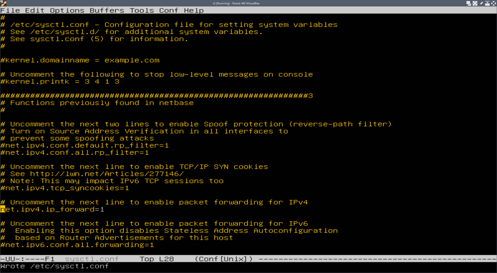

# Table of Contents

1.  [Linux](#org21e77ca)
    1.  [Часть 1. ipcalc tool](#org9946be1)
        1.  [1.1 Сети и маски](#orgddd8ee3)
        2.  [1.2 localhost](#org5dd1fc1)
        3.  [1.3 Диапазоны и сегменты сетей](#orgb2f30bc)
    2.  [Часть 2. Статическая маршрутизация между двумя машинами](#org82e86e3)
        1.  [2.1 Добавление статического маршрута вручную](#org62ce5c9)
        2.  [2.2 Добавление статического маршрута с сохранением](#orgb1c506a)
    3.  [Часть 3. Утилита iperf3](#org49cb103)
        1.  [3.1  Скорость соединения](#org67857f1)
        2.  [3.2 Утилита iperf3](#orgf3b94e8)
    4.  [Часть 4. Сетевой экран](#orgc87bcca)
        1.  [4.1. Утилита iptables](#orgffb557a)
        2.  [4.2. Утилита nmap](#org10e792c)
    5.  [Часть 5 Статическая маршрутизация сети](#org679d236)
        1.  [5.1 Настройка адресов машин](#orgad23d70)
        2.  [5.2 Включение переадресации IP-адресов](#orgeda8589)
        3.  [5.3 Установка маршрута по умолчанию](#org0d1cc6f)
        4.  [5.4 Добавление статических маршрутов](#orge5e94cf)
        5.  [5.5 Построение списка маршрутизаторов](#org8c9e1bd)
        6.  [5.6 Использование протокола ICMP при маршрутизации](#orgee42c2c)
    6.  [Часть 6. Динамическая настройка IP с помощью DHCP](#org01235a1)
    7.  [Часть 7. NAT](#org5c562c4)

# Linux

## Часть 1. ipcalc tool

### 1.1 Сети и маски

1.  
    
    Адрес сети

2.  255.255.255.0:
    
    -   24 в префиксной записи
    -   11111111.11111111.11111111.0 в двоичной записи
    
    11111111.11111111.11111111.11110000:
    
    -   255.255.255.240 в обычной записи
    -   28 в префиксной записи

3.  Минимальный и максимальный хост в сети 12.167.38.4 при масках:
    1.  /8.
        
    
    2.  11111111.11111111.00000000.00000000
        
    
    3.  255.255.254.0
        
    
    4.  /4
        

### 1.2 localhost

Можно ли обратиться к приложению, работающему на localhost, со следующими IP:

-   194.34.23.100 - нельзя
-   127.0.0.2 - можно
-   127.1.0.1 - можно
-   128.0.0.1 - нельзя

### 1.3 Диапазоны и сегменты сетей

1.  Какие из перечисленных IP можно использовать в качестве публичного, а какие только в качестве частных:
    -   10.0.0.45 - частная
    -   134.43.0.2 - публичная
    -   192.168.4.2 - частная
    -   172.20.250.4 - частная
    -   172.0.2.1 - публичная
    -   192.172.0.1 - публичная
    -   172.68.0.2 - публичная
    -   172.16.255.255 - частная
    -   10.10.10.10 - частная
    -   192.169.168.1 - публичная
2.  Какие из перечисленных IP адресов шлюза возможны у сети 10.10.0.0/18:
    -   10.0.0.1 - возможно
    -   10.10.0.2 - возможно
    -   10.10.10.10 - возможно
    -   10.10.100.1 - невозможно
    -   10.10.1.255 - возможно

## Часть 2. Статическая маршрутизация между двумя машинами

сетевые интерфейсы ws1

сетевые интерфейсы ws2

config.yaml для ws1

config.yaml для ws2

### 2.1 Добавление статического маршрута вручную

Соединение от ws1 к ws2 по статическому ip-адресу

Соединение от ws2 к ws1 по статическому ip-адресу

### 2.2 Добавление статического маршрута с сохранением

Соединение от ws1 к ws2 по статическому ip-адресу

Соединение от ws2 к ws1 по статическому ip-адресу

## Часть 3. Утилита iperf3

### 3.1  Скорость соединения

-   8 Mbps = 1 MBs
-   100 MB/s = 800000 kbps
-   1 Gbps =  1000 Mbps

### 3.2 Утилита iperf3

iperf3 сервер на ws2

Скорость соединения ws1 с ws2

## Часть 4. Сетевой экран

### 4.1. Утилита iptables

filewall.sh на ws1

filewall.sh на ws2

Запуск скрипта на ws1

Запуск скрипта на ws2

Пинг с ws1 на ws2 виден, но не разрешён. Пинг с ws2 на ws1 отсутствует.

### 4.2. Утилита nmap

ping ws2 с ws1

ping ws1 с ws2

nmap запущенный на ws2

nmap запущенный на ws1

## Часть 5 Статическая маршрутизация сети

### 5.1 Настройка адресов машин

00-installer-config.yaml на ws11

00-installer-config.yaml на r1

00-installer-config.yaml на ws21

00-installer-config.yaml на ws22

00-installer-config.yaml на r2

Сетевые интерфейсы ws11

Сетевые интерфейсы r1

Сетевые интерфейсы ws21

Сетевые интерфейсы ws22

Сетевые интерфейсы r2

ping с ws21 до ws22

ping с ws11 до r1

### 5.2 Включение переадресации IP-адресов

Включение переадресации IP-адресов на r1

Включение переадресации IP-адресов на r2

Включение переадресации IP-адресов с помощью /etc/sysctl.conf на r1

Включение переадресации IP-адресов с помощью /etc/sysctl.conf на r2

### 5.3 Установка маршрута по умолчанию

Конфигурация r1

Таблица маршрутизации r1

Вывод команды tcpdump на r2

### 5.4 Добавление статических маршрутов

Конфигурационный файл для r1

Вывод команды ip r для r1

Конфигурационный файл для r2

Вывод команды ip r для r2

Вывод команды ip r list 10.10.0.0/18 для ws11

Вывод команды ip r list 0.0.0.0/0 для ws11

Маршруты команд различаются, потому что 0.0.0.0/0 - это статический маршрут по умолчанию

### 5.5 Построение списка маршрутизаторов

Вывод команды tracepath на ws11

Вывод команды tcpdump -tnv -i enp0s8 на r1

### 5.6 Использование протокола ICMP при маршрутизации

Вывод команды ping -c 3 10.30.0.111 на ws1

Вывод команды tcpdump -tnv -i enp0s8 на r1

## Часть 6. Динамическая настройка IP с помощью DHCP

Конфигурация файла /etc/dhcp/dhcpd.conf на r2

Конфигурация файла /etc/resolf.conf на r2

Запуск dhcp процесса на r2

IP адрес ws21

ping ws22 с ws21

00-installer-config.yaml для ws11 с указанием mac адреса

00-installer-config.yaml для r1

ip адрес ws11 до обновления

обновление ip адреса на ws11

## Часть 7. NAT

Настройка общедоступности apache для ws22

Настройка общедоступности apache для r1

Запуск apache2 на ws22

Запуск apache2 на r1

запуск firewall на r2

ping ws22 с r1

Разрешение маршрутизации ICMP на r2

ping ws22 с r1

Добавление SNAT и DNAT на r2

подключение с помощью telnet с ws22 к r1

подключение с помощью telnet с r1 к ws22

